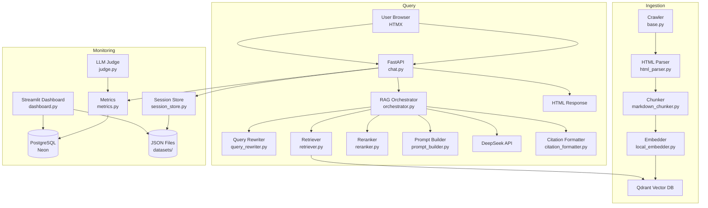
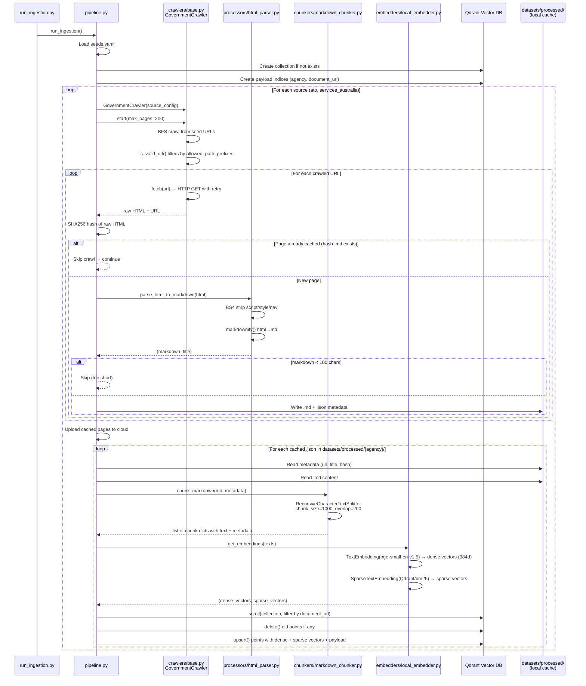
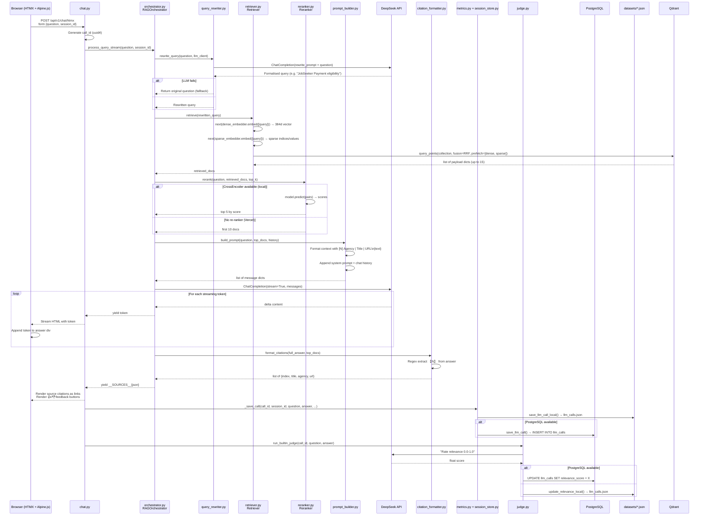
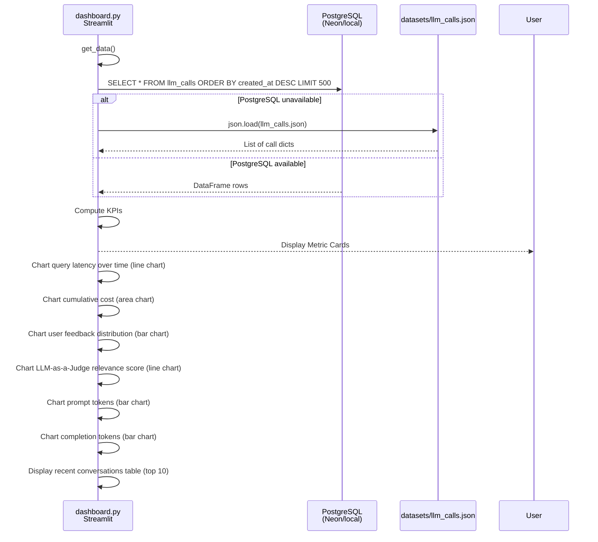

# Data Flow Documentation

## Architecture Overview

---

## Stage 1: Ingestion Pipeline

**Entry point:** `scripts/run_ingestion.py` → calls `backend/ingestion/pipeline.run_ingestion()`

### Flow

### Key Files (Ingestion)

| File | Responsibility |
|------|---------------|
| `scripts/run_ingestion.py` | Entry point — imports and calls pipeline |
| `backend/ingestion/pipeline.py` | Orchestrates crawl → parse → chunk → embed → upsert; uploads cached pages on re-run |
| `backend/ingestion/crawlers/base.py` | BFS crawler with retry (`tenacity`); `is_valid_url()` filters by `allowed_path_prefixes` and `denied_path_keywords` from `seeds.yaml` |
| `backend/ingestion/processors/html_parser.py` | Uses BeautifulSoup + markdownify + trafilatura to strip boilerplate and convert HTML to clean Markdown |
| `backend/ingestion/chunkers/markdown_chunker.py` | `langchain-text-splitters` `RecursiveCharacterTextSplitter` — 1000 char chunks, 200 char overlap |
| `backend/ingestion/embedders/local_embedder.py` | `fastembed.TextEmbedding` (dense, bge-small-en-v1.5 384d) + `SparseTextEmbedding` (BM25); zero-cost CPU inference |
| `datasets/seeds.yaml` | URL seed configuration for ATO and Services Australia |

### Data Flow Detail (Ingestion)

1. **Load config:** `pipeline.py:26-27` reads `datasets/seeds.yaml`
2. **Connect Qdrant:** `pipeline.py:29-37` creates `QdrantClient` with host/port/api_key/https from `config.py` env vars
3. **Create collection:** `pipeline.py:39-48` creates `government_documents` with dense (384d Cosine) + sparse vector configs
4. **Create indices:** `pipeline.py:51-57` creates keyword payload indices on `agency` and `document_url` (required for filtered scroll on Qdrant Cloud)
5. **Crawl:** `pipeline.py:60-61` — `GovernmentCrawler.start(max_pages=200)` BFS from seed URLs:
   - `base.py:16-38` — `fetch()` with 3 retries, exponential backoff, browser-like headers
   - `base.py:40-50` — `is_valid_url()` — path must match `allowed_path_prefixes`, must not match `denied_path_keywords`
   - `base.py:62-63` — Seed URLs bypass `is_valid_url` check
6. **Parse:** `pipeline.py:67-80` — `parse_html_to_markdown(html)` strips `<script>`, `<style>`, `<nav>`, etc.; converts to Markdown
7. **Chunk:** `pipeline.py:82-89` — `chunk_markdown(md, metadata)` splits text by `## `, `### `, `\n\n`, `. `, ` ` into chunks
8. **Embed:** `pipeline.py:91-95` — `get_embeddings(texts)` generates dense (384 float) + sparse (indices/values) vectors via FastEmbed
9. **Upsert:** `pipeline.py:97-127` — scrolls for old points by `document_url`, deletes if found, then upserts new `PointStruct`s with vector + payload

---

## Stage 2: Application Query Stage

**Entry point (HTMX):** `POST /api/v1/chat/htmx` → `backend/api/endpoints/chat.py:chat_htmx()`
**Entry point (JSON):** `POST /api/v1/chat` → `backend/api/endpoints/chat.py:chat_json()`

### Flow

### Key Files (Query)

| File | Responsibility |
|------|---------------|
| `backend/api/endpoints/chat.py` | HTMX/JSON endpoints — receives question, calls orchestrator, streams response, saves metrics |
| `backend/rag/orchestrator.py` | Orchestrates the full RAG pipeline: rewrite → retrieve → rerank → prompt → LLM → citations |
| `backend/rag/query_rewriter.py` | Calls DeepSeek API to rewrite slang/informal terms into formal government terminology ("dole" → "JobSeeker Payment") |
| `backend/rag/retriever.py` | Embeds query with FastEmbed (dense + sparse), performs hybrid search on Qdrant with RRF fusion |
| `backend/rag/reranker.py` | Cross-encoder re-ranker (local) or pass-through (Vercel); `Reranker.rerank(question, docs, top_k)` |
| `backend/rag/prompt_builder.py` | Constructs the LLM prompt with system instructions, context docs, chat history, and question |
| `backend/rag/citation_formatter.py` | Regex extracts `【N】` markers from LLM output, maps to source documents |
| `backend/rag/metrics.py` | PostgreSQL persistence for llm_calls (latency, tokens, cost, feedback, relevance) |
| `backend/rag/session_store.py` | JSON file persistence for sessions and llm_calls (fallback when PostgreSQL unavailable) |
| `backend/rag/judge.py` | LLM-as-a-judge background task — scores answer relevance 0.0–1.0 via DeepSeek API |
| `backend/core/database.py` | PostgreSQL connection management, schema creation (llm_calls, sessions tables) |
| `backend/api/deps.py` | FastAPI dependency injection — retrieves `RAGOrchestrator` from `app.state` |
| `backend/models/schemas.py` | Pydantic models: `ChatRequest`, `ChatResponse`, `CitationSource`, `SuggestionQuestion` |
| `backend/core/config.py` | Pydantic `BaseSettings` — reads all env vars (API keys, Qdrant host, DB URL, etc.) |
| `backend/main.py` | FastAPI app creation — `lifespan` initializes Qdrant client, OpenAI client, CrossEncoder, orchestrator |

### Data Flow Detail (Query)

1. **Request arrives** — `chat.py:125-191` — HTMX form POST or JSON POST
2. **Session** — `chat.py:133` — `session_id` from form or generated via `crypto.randomUUID()` in browser
3. **Query rewrite** — `orchestrator.py:70` → `query_rewriter.py:19-35`:
   - Sends `REWRITE_PROMPT` + raw question to DeepSeek API
   - Returns rewritten query on success, original on failure (try/except)
4. **Retrieval** — `orchestrator.py:71` → `retriever.py:21-53`:
   - Embeds query with `TextEmbedding` (dense 384d) + `SparseTextEmbedding` (BM25)
   - Sends `Prefetch` queries to Qdrant with `Fusion.RRF` → returns top 15 results
   - Checks collection existence first (raises clear error if missing)
5. **Re-ranking** — `orchestrator.py:72-74` → `reranker.py:5-16`:
   - Local: `CrossEncoder.predict()` scores all 15 docs, returns top 5
   - Vercel: model is None, returns first 10 docs (no re-ranking)
6. **Prompt building** — `orchestrator.py:75` → `prompt_builder.py:10-24`:
   - Wraps docs in `<context>` XML tags with `[N]` numbering
   - Appends `<chat_history>` if exists, then `<question>` tag
   - Prepends `SYSTEM_PROMPT` with grounding rules
7. **LLM call** — `orchestrator.py:78-89`:
   - `stream=True` for HTMX (tokens yielded in real-time)
   - `stream=False` for JSON endpoint (complete response returned)
   - Temperature 0.1, max_tokens 1000
8. **Citation formatting** — `orchestrator.py:91` → `citation_formatter.py:6-20`:
   - Regex `【(\d+)】` extraction from LLM output
   - Maps each index to `{index, title, agency, url}` from source docs
9. **Response streaming** — `chat.py:136-163`:
   - HTMX: yields user question bubble, then answer tokens, then sources, then feedback buttons
   - JSON: returns `ChatResponse(answer, sources)`
10. **Metrics persistence** — `chat.py:174-188`:
    - `_save_call()` writes to both JSON file (always) and PostgreSQL (try/except)
    - `run_builtin_judge()` runs in FastAPI `BackgroundTasks`
11. **User feedback** — `chat.py:77-87`:
    - 👍/👎 buttons POST to `/api/v1/feedback`
    - Updates `llm_calls.feedback` in PostgreSQL (with JSON fallback)

---

## Stage 3: Monitoring Stage

**Entry point:** `streamlit run monitoring/dashboard.py` → Streamlit app on port 8501

### Flow

### Key Files (Monitoring)

| File | Responsibility |
|------|---------------|
| `monitoring/dashboard.py` | Streamlit app — reads from PostgreSQL with JSON fallback; renders 4 metric cards + 6 charts + data table |
| `backend/rag/metrics.py` | Writes to PostgreSQL `llm_calls` table: call_id, session_id, question, answer, context, latency, tokens, cost, feedback, relevance_score |
| `backend/rag/session_store.py` | Reads/writes JSON files at `datasets/sessions.json` and `datasets/llm_calls.json` (fallback when PostgreSQL down) |
| `backend/rag/judge.py` | Background task — scores answer relevance (0.0–1.0) and writes to DB/JSON |
| `backend/core/database.py` | `init_db()` creates `llm_calls` + `sessions` tables; `get_db_connection()` returns psycopg2 connection |

### Data Flow Detail (Monitoring)

1. **Data source selection** — `dashboard.py:36-52` — tries PostgreSQL first, falls back to JSON file
2. **PostgreSQL schema** — `database.py:17-30`:
   - `llm_calls` table: `call_id, session_id, question, answer, context (JSON), latency_seconds, prompt_tokens, completion_tokens, total_cost, feedback (int: -1/0/1), relevance_score (float), created_at`
   - `sessions` table: `session_id, title, created_at, updated_at`
3. **Metrics persistence chain** — `chat.py:174-189`:
   - `_save_call()` → `save_llm_call_local()` (JSON, always succeeds) → `save_llm_call()` (PostgreSQL, try/except)
   - `run_builtin_judge()` → background thread → `update_relevance_score()` (PostgreSQL) → `update_relevance_local()` (JSON fallback)
4. **Feedback flow** — `chat.py:77-87`:
   - User clicks 👍/👎 → HTMX POST `/api/v1/feedback` → `update_feedback(call_id, ±1)` (PostgreSQL) → `update_feedback_local()` (JSON fallback)
5. **Streamlit dashboard metrics**:
   - **Total Queries**: row count from DataFrame
   - **Avg Latency**: `df['latency_seconds'].mean()`
   - **Total Cost**: `df['total_cost'].sum()`
   - **Avg Relevance**: `df['relevance_score'].mean()` (only rows where not null)

---

## Qdrant Collection Schema

| Field | Type | Description |
|-------|------|-------------|
| `chunk_id` | Payload string | `{sha256_hash}_chunk_{N}` — unique per chunk |
| `document_url` | Payload keyword (indexed) | Source URL of the page |
| `agency` | Payload keyword (indexed) | `ATO` or `SERVICES_AUSTRALIA` |
| `category` | Payload string | Document category (default "General") |
| `document_title` | Payload string | Page title from `<h1>` or `<title>` |
| `text` | Payload string | Chunk content (1000 chars) |
| `dense` | Dense vector (384d) | FastEmbed bge-small-en-v1.5 embedding |
| `sparse` | Sparse vector (BM25) | FastEmbed Qdrant/bm25 embedding |

## PostgreSQL Schema (Monitoring)

### `llm_calls`

| Column | Type | Description |
|--------|------|-------------|
| `id` | SERIAL PRIMARY KEY | Internal auto-increment |
| `call_id` | VARCHAR(255) UNIQUE | UUID v4 |
| `session_id` | VARCHAR(255) | Chat session UUID |
| `question` | TEXT | User's question |
| `answer` | TEXT | LLM's response |
| `context` | TEXT | JSON array of {title, agency} |
| `latency_seconds` | FLOAT | End-to-end query time |
| `prompt_tokens` | INT | Estimated from question length |
| `completion_tokens` | INT | Estimated from word count × 1.3 |
| `total_cost` | FLOAT | (prompt/1000 × 0.00014) + (completion/1000 × 0.00028) |
| `feedback` | INT | -1 (👎), 0 (none), 1 (👍) |
| `relevance_score` | FLOAT | LLM-as-a-judge score 0.0–1.0 |
| `created_at` | TIMESTAMP | Auto-set on INSERT |

### `sessions`

| Column | Type | Description |
|--------|------|-------------|
| `session_id` | VARCHAR(255) PRIMARY KEY | UUID v4 |
| `title` | TEXT | First 80 chars of first question |
| `created_at` | TIMESTAMP | Session creation time |
| `updated_at` | TIMESTAMP | Last message time |

---

## Deployment Mode Differences

| Aspect | Local Docker | Vercel Cloud |
|--------|-------------|--------------|
| **Qdrant** | Docker container `localhost:6333` | Qdrant Cloud (free tier) |
| **PostgreSQL** | Docker container `localhost:5432` | Neon (free tier) |
| **Re-ranker** | CrossEncoder (`sentence-transformers`) | None (disabled — PyTorch too large) |
| **top_k passed to LLM** | 5 (re-ranked) | 10 (no re-ranking) |
| **Static files** | Served by FastAPI `/static` mount | Served by Vercel CDN |
| **Ingestion** | Crawls → processes → uploads to local Qdrant | Must run locally with cloud env vars |
| **Streamlit dashboard** | Local `localhost:8501` | Deploy separately to Streamlit Cloud |
